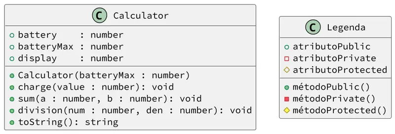

# Uma calculadora com bateria

<!-- toch -->
[Intro](#intro) | [Guide](#guide) | [Shell](#shell) | [Draft](#draft) 
-- | -- | -- | -- 
<!-- toch -->


## Intro

O objetivo dessa atividade é implementar uma calculadora que utiliza bateria. Se há bateria, ela executa operações de soma e divisão. É possível também mostrar a quantidade de bateria e recarregar a calculadora. Ela avisa quando está sem bateria e se há tentativa de divisão por 0.

- Descrição
  - A calculadora possui um display `display` e uma bateria `battery`. Ela guarda o valor atual da bateria e o valor máximo `batteryMax`.
  - O display é onde o resultado das operações é armazenado.
  - A bateria é a quantidade de energia que a calculadora possui.
  - Cada operação gasta um ponto de bateria.
  - A calculadora não pode realizar operações se não houver bateria.
  - A calculadora não pode realizar divisões por zero.
- Construtor
  - Requisição `$init batteryMax`
  - Receba o máximo de bateria como parâmetro no construtor da Calculadora.
- `toString`
  - Deve ser invocado na requisição `$show`.
  - Retorna a representação da calculadora no formato:
    - `display = {display:.2f}, battery = {battery}"`
    - Exemplo: `display = 0.00, battery = 0`
- Recarregar
  - Requisição: `$charge increment`
  - Adiciona carga à bateria, mas não pode ultrapassar o limite.
- Somar
  - Requisição: `$sum a b`
  - Soma dois valores e guarda no display.
  - Se não houver bateria, emita a mensagem `fail: bateria insuficiente`.
- Divisão
  - Requisição: `$div den num`
  - Divide dois valores e guarda no display.
  - Se não houver bateria, emita a mensagem `fail: bateria insuficiente`.
  - Se houver divisão por zero, emita a mensagem `fail: divisao por zero`.

## Guide



<!-- [](https://youtu.be/oZYwuP3CKJM?si=uVdiZn8tXbwUGH41) -->

- Como formatar com duas casas decimais em Kotlin.

```kotlin
import java.text.DecimalFormat

// kotlin 
override fun toString(): String {
    val df = DecimalFormat("0.00")
    return "display = ${df.format(display)}, battery = $battery"
}
```

## Shell

### Primeira simulação

```bash
#TEST_CASE iniciar mostrar e recarregar

$init 5
$show
display = 0.00, battery = 0

```

```bash
#TEST_CASE charge

$charge 3
$show
display = 0.00, battery = 3
$charge 1
$show
display = 0.00, battery = 4
```

```bash
#TEST_CASE boundary

$charge 2
$show
display = 0.00, battery = 5
```

```bash
#TEST_CASE reset

$init 4
$charge 2
$show
display = 0.00, battery = 2
$charge 3
$show
display = 0.00, battery = 4

```

```bash
$end
```

### Segunda simulação

```bash
#TEST_CASE somando

$init 2
$charge 2
$sum 4 3
$show
display = 7.00, battery = 1
```

```bash
#TEST_CASE gastando bateria

$sum 2 3
$show
display = 5.00, battery = 0
```

```bash
#TEST_CASE sem bateria

$sum -4 -1
fail: bateria insuficiente
```

```bash
#TEST_CASE recarregando

$charge 1
$show
display = 5.00, battery = 1
$sum -4 -2
$show
display = -6.00, battery = 0
```

```bash
$end
```

### Terceira simulação

```bash
#TEST_CASE dividindo

$init 3
$charge 3
$div 6 3
$show
display = 2.00, battery = 2
```

```bash
#TEST_CASE dividindo por zero gastando bateria

$div 7 0
fail: divisao por zero
$show
display = 2.00, battery = 1
```

```bash
#TEST_CASE gastando bateria

$div 7 2
$div 10 2
fail: bateria insuficiente
$show
display = 3.50, battery = 0
```

```bash
$end
```

## Draft

<!-- links .cache/drafts -->
- kotlin 
  - [shell.kt](.cache/drafts/kotlin/shell.kt)
<!-- links -->

<!--## Cheat

- cpp
  - [shell.cpp](.cache/cheat/cpp/shell.cpp)
- java
  - [Shell.java](.cache/cheat/java/Shell.java)
- ts
  - [shell.ts](.cache/cheat/ts/shell.ts)
 links -->
